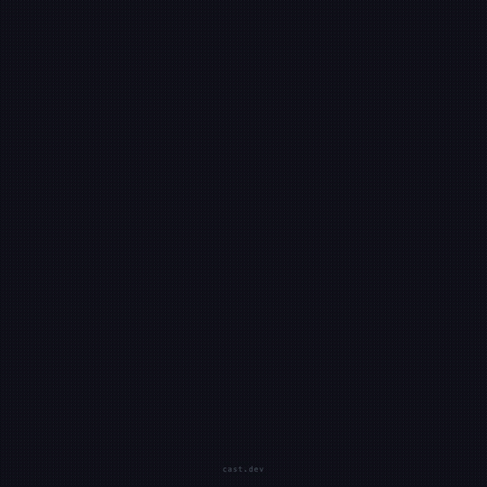

# agentcast

Turn your Claude Code sessions into viral videos.

<p align="center">
  
</p>

```bash
agentcast
```

One command. It takes a screenshot of your result, reads the Claude Code session log, and renders a polished video — prompt, result, stats.

## How it works

1. **Screenshot** — captures your screen (or a URL via headless Chrome)
2. **Session** — reads the Claude Code JSONL log for the prompt, timing, and action count
3. **Video** — renders a 1080x1080 MP4 with [Remotion](https://remotion.dev): typing animation, screenshot reveal, stats card

The output is ready for Twitter/X, LinkedIn, or anywhere you want to flex.

## Install

```bash
git clone git@github.com:islo-labs/agentcast.git
cd agentcast
make build
cd web && npm install && cd ..
```

## Usage

```bash
# After Claude finishes, just:
agentcast

# Screenshot a specific URL:
agentcast http://localhost:3000

# Use an existing screenshot:
agentcast --screenshot result.png

# Override the prompt text:
agentcast -p "Build me a landing page"

# Point to a specific session:
agentcast --session ~/.claude/projects/.../session.jsonl

# Custom output path:
agentcast -o my-video.mp4
```

## What the video looks like

| Act 1 | Act 2 | Act 3 |
|-------|-------|-------|
| "I asked Claude to..." | Your screenshot | Duration, files, cost |
| Typing animation | Scale-in with shadow | Spring-animated stats |

10 seconds. 1080x1080. Spring animations. Dark theme. Ready for Twitter/X.

## Project structure

```
agentcast/
├── cmd/cast/         # Go CLI entry point
├── internal/
│   ├── cmd/          # CLI commands
│   ├── session/      # Claude Code JSONL parser
│   ├── recorder/     # Terminal recording (PTY capture)
│   ├── player/       # Terminal playback
│   ├── asciicast/    # Asciicast v2 format
│   ├── render/       # GIF renderer (Go-native)
│   ├── vt/           # Minimal VT100 terminal emulator
│   └── storage/      # Local recording management
├── web/              # Remotion video renderer
│   └── src/          # React components for the video
├── go.mod
└── Makefile
```

## Requirements

- Go 1.21+
- Node.js 18+
- Chrome (for URL screenshots)

## Credits

Default background music: ["Go Create"](https://uppbeat.io/track/all-good-folks/go-create) by All Good Folks (via [Uppbeat](https://uppbeat.io))

## License

MIT
